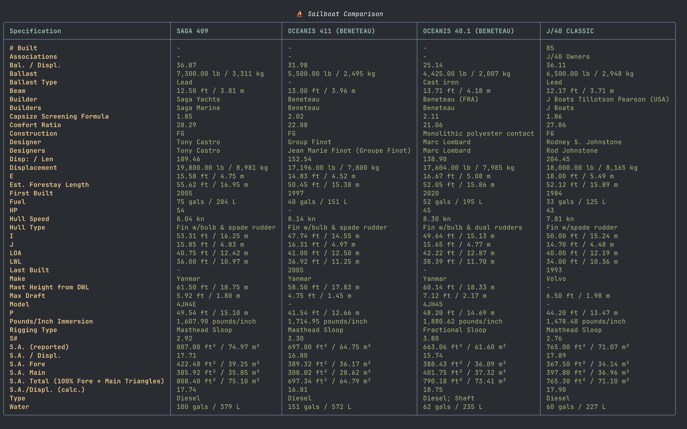

# Sailboat Data Comparison Tool

A Python CLI tool for comparing sailboat specifications scraped from [sailboatdata.com](https://sailboatdata.com).

## Features

- 🔍 Scrape sailboat specifications from sailboatdata.com
- 🔎 Intelligent boat name search with automatic variations (number-word conversions, spacing, etc.)
- 📊 Compare multiple boats side-by-side
- 🎨 Beautiful table output with Rich library
- 📄 PDF export with professional formatting
- 🔧 Nix flake for reproducible development environment
- 📋 JSON export option
- 🧹 Filtered output (excludes UI elements like forum topics)
- ⚖️ Automatic attribution to sailboatdata.com in all outputs

## Prerequisites

Choose one of the following installation methods:
- [Nix](https://nixos.org/download.html) with flakes enabled (recommended)
- Python 3.11+ with pip
- Conda/Mamba
- uv (fast Python package installer)

## Installation & Setup

### Using Nix (Recommended)

1. Enable Nix flakes (if not already enabled):
```bash
# Add to ~/.config/nix/nix.conf or /etc/nix/nix.conf
experimental-features = nix-command flakes
```

2. Enter the development environment:
```bash
nix develop
```

Or use direnv for automatic environment loading:
```bash
direnv allow
```

### Using pip

```bash
pip install -r requirements.txt
```

### Using Conda

```bash
conda env create -f environment.yml
conda activate sailboat-compare
```

### Using uv

```bash
uv venv
source .venv/bin/activate  # On Windows: .venv\Scripts\activate
uv pip install -r requirements.txt
```

## Usage

Compare two or more sailboats:

```bash
python sailboat_compare.py "Catalina 30" "Hunter 33"
```

Compare multiple boats:

```bash
python sailboat_compare.py "J/24" "J/80" "J/70"
```

Export to JSON:

```bash
python sailboat_compare.py "Catalina 30" "Hunter 33" --format json
```

Export to PDF:

```bash
python sailboat_compare.py "Catalina 30" "Hunter 33" --pdf comparison.pdf
```

Combine table output and PDF export:

```bash
python sailboat_compare.py "J/24" "J/80" "J/70" --pdf boats.pdf
```

Get help:

```bash
python sailboat_compare.py --help
```

## How It Works

1. The tool normalizes boat names to URL-friendly format
2. If a boat is not found, automatically tries common variations:
   - Number-word conversions (e.g., "30" ↔ "thirty")
   - Spacing variations (e.g., "Catalina30" ↔ "Catalina 30")
   - Decimal handling (e.g., "40.1" → "401")
   - Brand/model reordering (e.g., "Beneteau Oceanis 40.1" → "Oceanis 401 Beneteau")
3. Fetches boat pages from sailboatdata.com using pattern: `/sailboat/{normalized-name}`
4. Parses HTML to extract specifications using BeautifulSoup with lxml parser
5. Filters out unwanted UI elements (forum topics, navigation links)
6. Displays results in a formatted comparison table using Rich

## Example Output



## Development

### Project Structure

```
.
├── flake.nix              # Nix flake configuration
├── sailboat_compare.py    # Main CLI application
├── README.md              # This file
├── .gitignore            # Git ignore patterns
└── .envrc                # Direnv configuration
```

### Nix Development Shell

The flake provides a complete Python development environment with all dependencies:

- Python 3.11
- requests (HTTP client)
- beautifulsoup4 (HTML parsing)
- click (CLI framework)
- rich (terminal formatting)
- lxml (fast XML/HTML parser)
- reportlab (PDF generation)

## Notes

- The tool uses appropriate User-Agent headers
- Intelligent name search tries multiple variations automatically
- Provides feedback when boats are found under alternative names
- Specifications extracted depend on the HTML structure of sailboatdata.com
- Handles multiple HTML parsing strategies (tables, definition lists, divs)

## License

MIT

## ⚠️ IMPORTANT LEGAL DISCLAIMER

**YOU MUST OBTAIN PERMISSION BEFORE USING THIS TOOL**

This tool performs automated data collection from sailboatdata.com, which **violates their Terms of Service** without explicit written permission.

### Terms of Service Violations

Sailboatdata.com's Terms of Service (Section 6) explicitly prohibit:
- "systematic or automated data collection activities"
- Use of automated tools that are "not a web browser"

### Required Actions Before Use

1. **Request Permission**: Contact sailboatdata.com at https://sailboatdata.com/contact/
2. **Obtain Written Authorization**: Get explicit permission for automated access
3. **Comply with Their Terms**: Follow any rate limits, attribution requirements, or other conditions they specify

### Legal Risk

Using this tool without permission may:
- Violate sailboatdata.com's Terms of Service
- Infringe on their intellectual property rights
- Result in legal action or IP blocking

### Recommended Use

This repository is provided **for educational purposes only** to demonstrate web scraping techniques. The maintainers:
- Do NOT endorse unauthorized use
- Are NOT responsible for any legal consequences
- Recommend obtaining proper authorization or using official APIs when available

**See `permission_request_email.md` for a template to request access from sailboatdata.com.**
